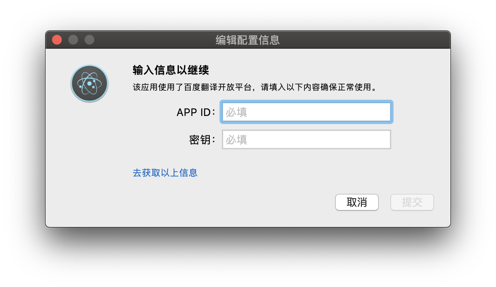

## 快译
快译是一个能够让你沉侵式翻译体验的mac桌面应用。不用切换应用，只需将你要翻译的单词或短句复制到剪切板即可自动翻译到菜单栏或通知里。
## 效果展示
### 菜单栏翻译

### 系统通知翻译

## 使用方法
第一次使用会要求输入app ID和密钥如下图所示：

获取方式直接在百度注册即可
1. 打开 [百度翻译开放平台](http://api.fanyi.baidu.com/api/trans/product/index)；
2. 选择通用翻译API；
3. 选择标准版或高级版，标准版调用为1秒一次，个人使用足够了。高级版超过200万字符后需要充钱；
4. 注册完成后获取app ID和密钥并填写到该app中。
